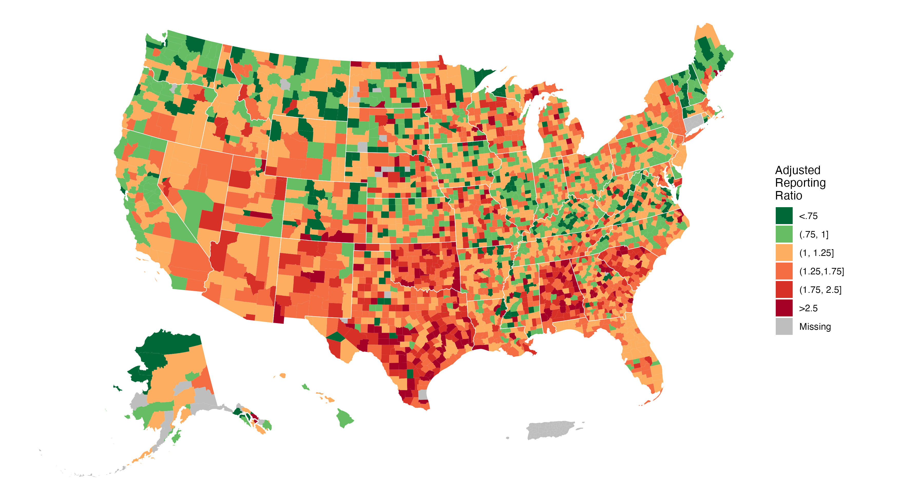

<!-- README.md is generated from README.Rmd. Please edit that file -->

# `unclassified_covid_deaths`

<p align="center">


</p>

## Introduction

Data and reproducible code for our *Science Advances* paper, “[Applying
Machine Learning to Identify Unrecognized COVID-19 Deaths Recorded as
Other Causes of Death in the United
States](https://doi.org/10.1126/sciadv.aef5697)”, which uses machine
learning methods on [restricted-access mortality data from the National
Center for Health
Statistics](https://www.cdc.gov/nchs/nvss/nvss-restricted-data.htm) to
estimate the number of unclassified COVID-19 deaths in the US from
2020-2021.

The full citation is:

> Kiang MV, Li ZR, Wrigley-Field E, Raquib RV, Lungberg DJ, Paglino E,
> Huynh B, Bibbins-Domingo K, Glymour MM, Stokes AC. Applying machine
> learning to identify unrecognized COVID-19 deaths recorded as other
> causes of death in the United States. *Science Advances*. 2026. doi:
> 10.1126/sciadv.aef5697.

### Abstract

The actual number of U.S. deaths caused by SARS-CoV-2 infection has been
investigated and debated since the start of the COVID-19 pandemic. Here,
we use machine learning trained on U.S. death certificates from March
2020 to December 2021 to predict 155,536 (95% UI: 150,062 to 161,112)
unrecognized COVID-19 deaths. This indicates 19% more COVID-19 deaths
occurred in the U.S. than officially reported. Predicted unrecognized
COVID-19 deaths occurred disproportionately among decedents with less
than a high school education; decedents identified as Hispanic, American
Indian, Alaska Native, Asian, and/or Black; counties with lower
household incomes and worse preexisting health; and counties in the
South. These findings suggest the U.S. death investigation system
undercounted COVID-19 deaths unevenly, hiding the true extent of
inequities.

### Issues

Please report issues via email or the [issues
page](https://github.com/mkiang/unclassified_covid_deaths/issues).

## Computational considerations

This project does not necessitate a high performance computer
environment; however, we note many models are memory intensive and/or
require long compute times. Most models will run on a compute
environment with 128GB of memory, but we note some models required
setting up 196GB of memory to run. Similarly, most models can be run
within a day (per fold) but others may take up to a week.

## Structure

This project is structured as follows:

- **`code`**: Contains all code used for this project. Designed to be
  run sequentially. A brief overview of the code files is provided
  below. More detailed information is provided at the beginning of most
  files.
- **`data`**: Contains the subset of intermediate files that do not
  contain individual-level data (and can therefore be shared).
- **`data_private`** \[not shared\]: Contains data that cannot be
  shared. Both the individual-level mortality files and intermediate
  files that are at the individual level (e.g., propensity scores).
- **`data_raw`**: Contains all (publicly available) raw data necessary
  to run the analysis. See also
  [`./data_raw/README.md`](./data_raw/README.md).
- **`output/figure_data`**: Contains numerical representations (in `csv`
  format) of all primary figures.
- **`output/models`** \[not shared\]: Contains model objects fit to the
  raw data. Because model objects contain individual-level data, they
  are not shared.
- **`output/out_of_hosp`** \[not shared\]: Contains out of hospital
  predictions and all bootstraps. These predictions occur at the
  individual level and are therefore not shared. The exceptions is the
  `output/out_of_hosp/summaries` folder (and its subfolders), which
  contain the bootstrap summaries of our results.
- **`plots`**: Contains figures used the manuscript in `jpg` and `pdf`
  formats.
- **`rmds`**: Contains code to generate tables used in the manuscript.

### `./code` folder

The analytic pipeline in the `./code`/ folder is designed to have each
file run sequentially. That is, each file performs a discrete task and
some tasks may be dependent on the output of previous tasks.

- `01` takes in the raw NCHS data (in our environment, these are
  `data_private/MULT2020.USAllCnty.zip` and
  `data_private/MULT2021US.AllCnty.txt.zip`) and cleans them up.
- `02` creates the analytic training (i.e., in hospital) data set
  combining both the individual-level death data and the publicly
  available data.
- `03` creates the prediction (i.e., out of hospital) data set combining
  both the individual-level death data and the publicly available data.
- `04` loads the necessary files and data used to train the different
  models. Files `05` through `08` depend on this file and it is saved
  separately to reduce redundancy.
- `05` to `08` train different models (e.g., random forest).
- `09` evaluates model performance.
- `10` generates fair predictions by fitting our preferred model to some
  subset of data and creating predictions on a different subset. We do
  this sequentially so every observation has a prediction from a model
  that did not include it for training.
- `11` assess model fairness across a variety of metrics.
- `12` fit a propensity model for calculating adjustments.
- `13` calculate a variety of adjustments for sensitivity analyses.
- `14` fit bootstraps to our preferred model to get confidence
  intervals.
- `15` summarize all the bootstrap predictions.
- `16` evaluate feature importance for our preferred model.
- `utils.R` contains utility functions that are used in multiple other
  files.
- `utils_*_receipes.R` contains the `{tidymodel}` recipes for model
  fitting.
- All other files generate the plots.

## Authors (alphabetical):

- Kirsten Bibbins-Domingo
- Elizabeth Wrigley-Field
- M. Maria Glymour
- Benjamin Huynh
- [Mathew Kiang](https://mathewkiang.com)
  (:
  [mkiang](https://github.com/mkiang))
- Zehang Richard Li
- Dielle J. Lundberg
- Eugenio Paglino
- Rafeya V. Raquib
- Andrew C. Stokes

### Acknowledgements / Funding

The content is solely the responsibility of the authors and does not
necessarily represent the official views of the study sponsors. The
authors gratefully acknowledge receiving financial support from the W.K.
Kellogg Foundation and the Eunice Kennedy Shriver National Institute of
Child Health and Human Development (P2C HD041023).

### Competing interests

The authors report that they have no conflicts of interests to disclose.

## Reproducibility

All code necessary to reproduce the results in the paper are included in
this repository. We use a mix of publicly-available and
restricted-access data. We share some of the publicly-available data on
this repository; however, some files are too large to be stored on
Github. A copy of the `data`, `data_raw`, and
`output/out_of_hosp/summaries` folders are available on [Stanford
Digital Repository](https://purl.stanford.edu/vp329cx9286) (doi:
[10.25740/vp329cx9286](https://doi.org/10.25740/vp329cx9286)).

We share the intermediate and generated data when possible; however, in
adherence with [the NCHS data use
agreement](https://www.cdc.gov/nchs/nvss/nvss-restricted-data.htm#:~:text=The%20data%20files%20cannot%20be%20shared%20with%20any%20other%20individual%20not%20listed%20in%20the%20data%20use%20agreement.),
*we cannot share the individual-level death data* to train the models.

If interested researchers received access to the restricted data from
NCHS, we can provide intermediate files generated from the raw death
files (e.g., model fits). Please contact the corresponding author after
you have received approval from the NCHS. The code in this repository
may change over time in response to feedback and comments; however, the
state of the code at the time of submission/publication is available in
the [`at-submission`
release](https://github.com/mkiang/unclassified_covid_deaths/releases/tag/at-submission).

### Package management

This project uses the
[`renv`](https://rstudio.github.io/renv/articles/renv.html) package for
package version control. To use this, open the project in
[RStudio](https://rstudio.com/) and run `renv::restore()`.

### Session info

``` r
> sessioninfo::session_info()
─ Session info ────────────────────────────────────────────────────────────────
 setting  value
 version  R version 4.5.0 (2025-04-11)
 os       macOS 26.2
 system   aarch64, darwin20
 ui       RStudio
 language (EN)
 collate  en_US.UTF-8
 ctype    en_US.UTF-8
 tz       America/Los_Angeles
 date     2026-01-25
 rstudio  2025.05.0+496 Mariposa Orchid (desktop)

─ Packages ────────────────────────────────────────────────────────────────────
 ! package      * version    date (UTC) lib source
 P backports      1.5.0      2024-05-23 [?] CRAN (R 4.5.0)
 P bonsai       * 0.4.0      2025-06-25 [?] CRAN (R 4.5.0)
 P broom        * 1.0.11     2025-12-04 [?] CRAN (R 4.5.2)
 P cellranger     1.1.0      2016-07-27 [?] CRAN (R 4.5.0)
 P class          7.3-23     2025-01-01 [?] CRAN (R 4.5.0)
 P cli            3.6.5      2025-04-23 [?] CRAN (R 4.5.0)
 P codetools      0.2-20     2024-03-31 [?] CRAN (R 4.5.0)
 P config         0.3.2      2023-08-30 [?] CRAN (R 4.5.0)
 P data.table     1.18.0     2025-12-24 [?] CRAN (R 4.5.2)
 P dials        * 1.4.2      2025-09-04 [?] CRAN (R 4.5.0)
 P DiceDesign     1.10       2023-12-07 [?] CRAN (R 4.5.0)
 P digest         0.6.39     2025-11-19 [?] CRAN (R 4.5.2)
 P discrim      * 1.1.0      2025-12-02 [?] CRAN (R 4.5.2)
 P doParallel   * 1.0.17     2022-02-07 [?] CRAN (R 4.5.0)
 P dplyr        * 1.1.4      2023-11-17 [?] CRAN (R 4.5.0)
 P embed        * 1.2.1      2025-12-01 [?] CRAN (R 4.5.2)
 P evaluate       1.0.5      2025-08-27 [?] CRAN (R 4.5.0)
 P extrafont      0.20       2025-09-24 [?] CRAN (R 4.5.0)
 P extrafontdb    1.1        2025-09-28 [?] CRAN (R 4.5.0)
 P farver         2.1.2      2024-05-13 [?] CRAN (R 4.5.0)
 P fastmap        1.2.0      2024-05-15 [?] CRAN (R 4.5.0)
 P fastshap     * 0.1.1      2024-02-22 [?] CRAN (R 4.5.0)
   forcats      * 1.0.1      2025-09-25 [1] CRAN (R 4.5.0)
 P foreach      * 1.5.2      2022-02-02 [?] CRAN (R 4.5.0)
 P fs           * 1.6.6      2025-04-12 [?] CRAN (R 4.5.0)
 P furrr        * 0.3.1      2022-08-15 [?] CRAN (R 4.5.0)
 P future       * 1.69.0     2026-01-16 [?] CRAN (R 4.5.2)
 P future.apply   1.20.1     2025-12-09 [?] CRAN (R 4.5.2)
 P generics       0.1.4      2025-05-09 [?] CRAN (R 4.5.0)
 P ggplot2      * 4.0.1      2025-11-14 [?] CRAN (R 4.5.2)
 P glmnet       * 4.1-10     2025-07-17 [?] CRAN (R 4.5.0)
 P globals        0.18.0     2025-05-08 [?] CRAN (R 4.5.0)
 P glue           1.8.0      2024-09-30 [?] CRAN (R 4.5.0)
 P gower          1.0.2      2024-12-17 [?] CRAN (R 4.5.0)
 P GPfit          1.0-9      2025-04-12 [?] CRAN (R 4.5.0)
 P gtable         0.3.6      2024-10-25 [?] CRAN (R 4.5.0)
 P hardhat        1.4.2      2025-08-20 [?] CRAN (R 4.5.0)
   haven          2.5.5      2025-05-30 [1] CRAN (R 4.5.0)
 P here         * 1.0.2      2025-09-15 [?] CRAN (R 4.5.0)
   hms            1.1.4      2025-10-17 [1] CRAN (R 4.5.0)
 P htmltools      0.5.9      2025-12-04 [?] CRAN (R 4.5.2)
 P infer        * 1.1.0      2025-12-18 [?] CRAN (R 4.5.2)
 P ipred          0.9-15     2024-07-18 [?] CRAN (R 4.5.0)
 P iterators    * 1.0.14     2022-02-05 [?] CRAN (R 4.5.0)
 P janitor      * 2.2.1      2024-12-22 [?] CRAN (R 4.5.0)
 P jsonlite       2.0.0      2025-03-27 [?] CRAN (R 4.5.0)
 P knitr          1.51       2025-12-20 [?] CRAN (R 4.5.2)
 P lattice        0.22-6     2024-03-20 [?] CRAN (R 4.5.0)
 P lava           1.8.2      2025-10-30 [?] CRAN (R 4.5.0)
 P lhs            1.2.0      2024-06-30 [?] CRAN (R 4.5.0)
 P lifecycle      1.0.4      2023-11-07 [?] CRAN (R 4.5.0)
 P lightgbm     * 4.6.0      2025-02-13 [?] CRAN (R 4.5.0)
 P listenv        0.10.0     2025-11-02 [?] CRAN (R 4.5.0)
 P lobstr       * 1.1.3      2025-11-14 [?] CRAN (R 4.5.2)
 P lubridate    * 1.9.4      2024-12-08 [?] CRAN (R 4.5.0)
 P magrittr       2.0.3      2022-03-30 [?] CRAN (R 4.5.0)
 P MASS           7.3-65     2025-02-28 [?] CRAN (R 4.5.0)
 P MatchIt      * 4.7.2      2025-05-30 [?] CRAN (R 4.5.0)
 P Matrix       * 1.7-3      2025-03-11 [?] CRAN (R 4.5.0)
 P modeldata    * 1.5.1      2025-08-22 [?] CRAN (R 4.5.0)
   narcan       * 0.1.1      2026-01-26 [1] Github (mkiang/narcan@3d49259)
 P nnet           7.3-20     2025-01-01 [?] CRAN (R 4.5.0)
 P otel           0.2.0      2025-08-29 [?] CRAN (R 4.5.0)
 P parallelly     1.46.1     2026-01-08 [?] CRAN (R 4.5.2)
 P parsnip      * 1.4.1      2026-01-11 [?] CRAN (R 4.5.2)
 P patchwork    * 1.3.2      2025-08-25 [?] CRAN (R 4.5.0)
 P pillar         1.10.2     2025-04-05 [?] CRAN (R 4.5.0)
 P pkgconfig      2.0.3      2019-09-22 [?] CRAN (R 4.5.0)
   prettyunits    1.2.0      2023-09-24 [1] CRAN (R 4.5.0)
 P probably     * 1.2.0      2025-10-16 [?] CRAN (R 4.5.0)
 P prodlim        2025.04.28 2025-04-28 [?] CRAN (R 4.5.0)
 P purrr        * 1.2.1      2026-01-09 [?] CRAN (R 4.5.2)
 P R6             2.6.1      2025-02-15 [?] CRAN (R 4.5.0)
 P ranger       * 0.18.0     2026-01-16 [?] CRAN (R 4.5.2)
 P RColorBrewer   1.1-3      2022-04-03 [?] CRAN (R 4.5.0)
 P Rcpp           1.1.1      2026-01-10 [?] CRAN (R 4.5.2)
   readr        * 2.1.6      2025-11-14 [1] CRAN (R 4.5.2)
 P readxl       * 1.4.5      2025-03-07 [?] CRAN (R 4.5.0)
 P recipes      * 1.3.1      2025-05-21 [?] CRAN (R 4.5.0)
   renv           1.1.4      2025-03-20 [1] CRAN (R 4.5.0)
 P rlang          1.1.6      2025-04-11 [?] CRAN (R 4.5.0)
 P rmarkdown      2.30       2025-09-28 [?] CRAN (R 4.5.0)
 P ROSE           0.0-4      2021-06-14 [?] CRAN (R 4.5.0)
 P rpart          4.1.24     2025-01-07 [?] CRAN (R 4.5.0)
 P rprojroot      2.1.1      2025-08-26 [?] CRAN (R 4.5.0)
 P rsample      * 1.3.1      2025-07-29 [?] CRAN (R 4.5.0)
 P rstudioapi     0.18.0     2026-01-16 [?] CRAN (R 4.5.2)
 P Rttf2pt1       1.3.14     2025-09-26 [?] CRAN (R 4.5.0)
 P S7             0.2.1      2025-11-14 [?] CRAN (R 4.5.2)
 P scales       * 1.4.0      2025-04-24 [?] CRAN (R 4.5.0)
 P sessioninfo    1.2.3      2025-02-05 [?] CRAN (R 4.5.0)
 P shape          1.4.6.1    2024-02-23 [?] CRAN (R 4.5.0)
 P shapviz      * 0.10.3     2025-10-13 [?] CRAN (R 4.5.0)
 P snakecase      0.11.1     2023-08-27 [?] CRAN (R 4.5.0)
   stringi        1.8.7      2025-03-27 [1] CRAN (R 4.5.0)
   stringr      * 1.6.0      2025-11-04 [1] CRAN (R 4.5.0)
 P survival       3.8-6      2026-01-16 [?] CRAN (R 4.5.2)
 P tailor       * 0.1.0      2025-08-25 [?] CRAN (R 4.5.0)
 P themis       * 1.0.3      2025-01-23 [?] CRAN (R 4.5.0)
 P tibble       * 3.2.1      2023-03-20 [?] CRAN (R 4.5.0)
 P tictoc       * 1.2.1      2024-03-18 [?] CRAN (R 4.5.0)
 P tidymodels   * 1.4.1      2025-09-08 [?] CRAN (R 4.5.0)
   tidyr        * 1.3.2      2025-12-19 [1] CRAN (R 4.5.2)
 P tidyselect     1.2.1      2024-03-11 [?] CRAN (R 4.5.0)
 P tidyverse    * 2.0.0      2023-02-22 [?] CRAN (R 4.5.0)
 P timechange     0.3.0      2024-01-18 [?] CRAN (R 4.5.0)
 P timeDate       4051.111   2025-10-17 [?] CRAN (R 4.5.0)
 P tune         * 2.0.1      2025-10-17 [?] CRAN (R 4.5.0)
   tzdb           0.5.0      2025-03-15 [1] CRAN (R 4.5.0)
 P usmap        * 1.0.0      2025-08-29 [?] CRAN (R 4.5.0)
 P uwot           0.2.4      2025-11-10 [?] CRAN (R 4.5.0)
 P vctrs          0.6.5      2023-12-01 [?] CRAN (R 4.5.0)
 P withr          3.0.2      2024-10-28 [?] CRAN (R 4.5.0)
 P workflows    * 1.3.0      2025-08-27 [?] CRAN (R 4.5.0)
 P workflowsets * 1.1.1      2025-05-27 [?] CRAN (R 4.5.0)
 P xfun           0.56       2026-01-18 [?] CRAN (R 4.5.2)
 P xgboost        3.1.3.1    2026-01-12 [?] CRAN (R 4.5.2)
 P yaml           2.3.12     2025-12-10 [?] CRAN (R 4.5.2)
 P yardstick    * 1.3.2      2025-01-22 [?] CRAN (R 4.5.0)

 * ── Packages attached to the search path.
 P ── Loaded and on-disk path mismatch.
───────────────────────────────────────────────────────────────────────────────
```
